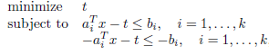

# Introduction
Remember to write the series of this based on what I've learnt and what I've harvested instead of what was said in this book. It's truly a way to make further progress.

# Mathematical Optimization
## How to organize about this part
Firstly, it gives the basic idea of optimization, linear program and convex optimization.

## Basic concept about optimization, linear program and convex optimization

1. Here is the form of **optimization**:

- objective function: minimize f0(x)
- subjective to : fi(x) <= bi, for i:1 to m
  where x = (x1, x2, ..., xm)

2. Linear Program:

    fi(ax+by) = a * fi(x) + b * fi(y)

    which means the coefficient of every constraint function is linear function including constants.

3. Nonlinear Program:

   The coefficient of every constraint function is **not** linear function.

4. Convex Optimization
  Convex Optimization is a general form of linear program which convert the equality in LR into inequality.

  Hence, we get:

  fi(ax+by) <= a * fi(x) + b * fi(y)

## Applications
Convex Optimization has been widely uses in many fields. Here is some typical examples about it:

- portfolio optimization: Get highest profits when investing
- Device Sizing: Decide the width and lenghth of a device that makes the use of energy of this system to be the lowest.
- Data fitting: The objective function of this problem is overfit or prediction error

## Solving Optimization Problems 
The algorithms vary from the form of our optimization problems. Meanwhile, it is difficult to find a effecient algorithm to solve optimization problems with a large scale except least-squares problem and linear programming.

# Least-Squares and Linear Programming

## Least-Squares Problems

### Definition

The objective function is a quadratic function without any constraint functions. A is a k * n matrix while x is a n-vector.

### Some expansion about LS

-  **Weight Least Squares**

-  **Regularization**

 	Regularization is one particular form of least-squares problem. Often, p is very small.

## Linear Programming

### Definition

### Some expansion about LP

- **Chebyshev approximation problem** 

Hence we can solve Chebyshev approximation problem as linear programming by this form:

## Convex Optimization
### Definition

### Solving Convex Optimization
It is not very difficult to solve the problem which we've recognized it as a convex problem. The key point is how to recognize and formulating one problem as a convex optimization. From now on, there are no technique can recognize and solve convex optimization. By the way, we can solve a convex problem by using interior-point methods.

## Nonlinear Problem
By far, no technique can be used to solve nonlinear problems perfectly. Every method used now has adapted some compromise. Typically, what need to be mentioned are local optimization and global optimization while local optimization is very fast to find the approximately optimal solution and global optimization can find the truly optimal solution losing efficency. Those two methods are widely used now based on the problem we study.

## Role of Convex optimization in Nonconvex Problem
- Initialization for local optimization
- Convex heuristics fron nonconvex optimization
- Bounds for global optimization

That's the end of the part of Introduction.

